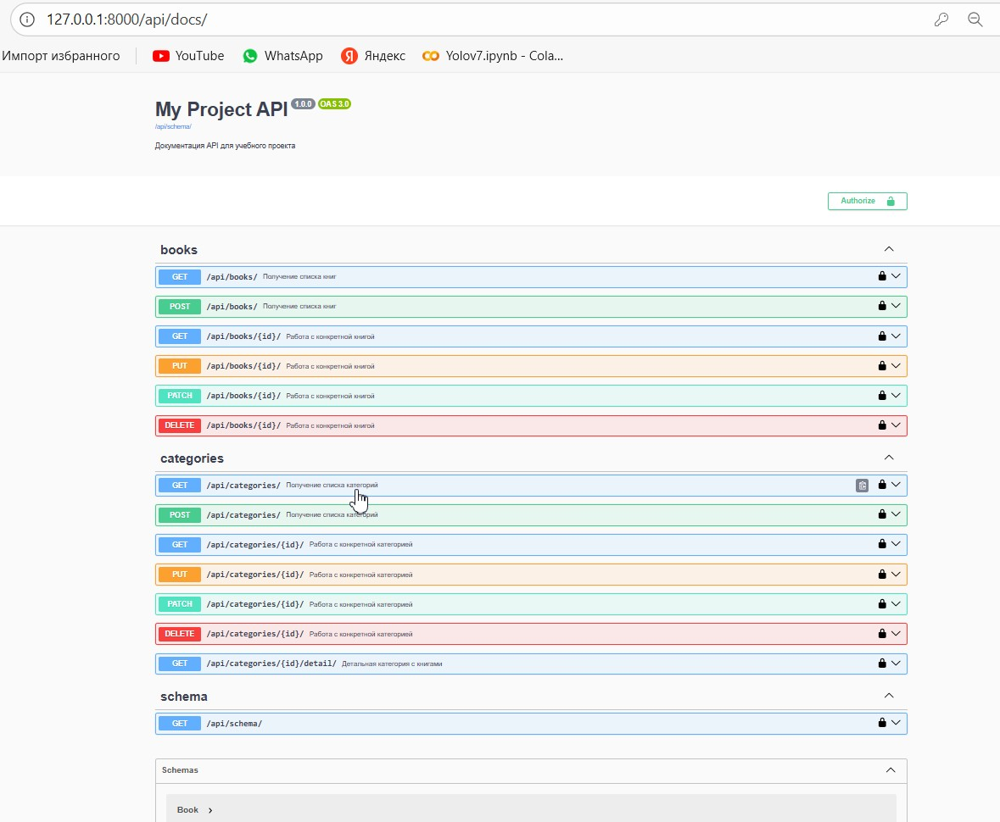
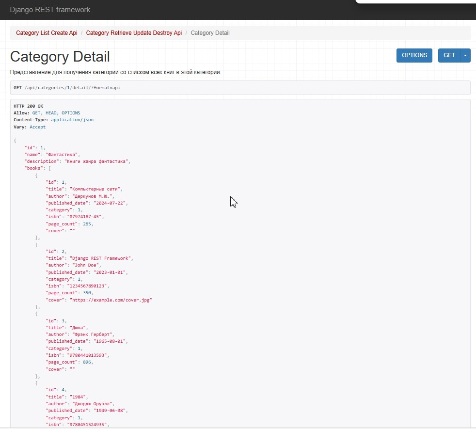
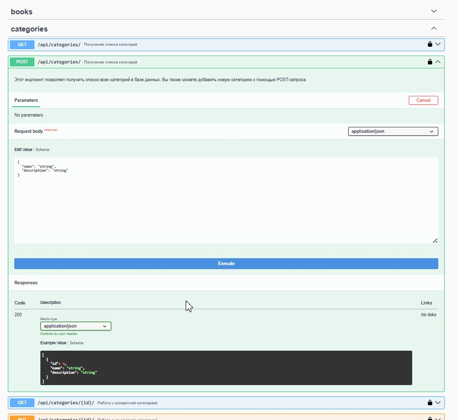
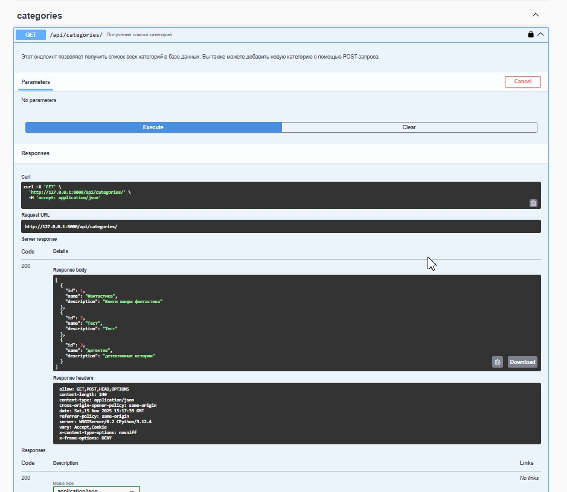

# BookCatalog-DRF-Advanced

<div align="center">
    
.
.
.


[🎥 Демонстрация системы](#-демонстрация-системы)• [🛠 Технологии](#-технологии)• [📚 Функциональность](#-функциональность)•[🔌 API Эндпоинты](#-api-эндпоинты)• [🚀 Установка и запуск](#-установка-и-запуск) • [## 🎯 Особенности реализации](#-особенности-реализации) • [📝 Примеры запросов](#-примеры-запросов)•[✅ Выполненные задания](#-выполненные-задания)•

Расширенный каталог книг с категориями на Django REST Framework с вложенными сериализаторами и полной документацией.

</div>

## 🎥 Демонстрация системы

### Swagger документация

*Полная документация API с возможностью тестирования*

## Эндпоинт категории с книгами

*Пример ответа с вложенными данными книг*

## Создание книги

*Форма создания книги с выбором категории*

## Список категорий

*Список всех категорий с пагинацией*


## 🛠 Технологии
- Python 3.8+
- Django 4.2+
- Django REST Framework
- DRF Spectacular (Swagger)
- SQLite

## 📚 Функциональность

- ✅ CRUD операции для книг и категорий
- ✅ Связь многие-к-одному (книги → категории)
- ✅ Вложенные сериализаторы
- ✅ Полная Swagger документация
- ✅ Оптимизированные запросы к БД

## 🏗 Модели данных

### Category
- `name` - название категории
- `description` - описание категории

### Book  
- `title` - название книги
- `author` - автор
- `published_date` - дата публикации
- `category` - связь с категорией (ForeignKey)

## 🔌 API Эндпоинты
```
| Метод | URL | Описание |
|-------|-----|-----------|
| GET | `/api/categories/` | Список категорий |
| POST | `/api/categories/` | Создание категории |
| GET | `/api/categories/{id}/` | Детали категории |
| GET | `/api/categories/{id}/detail/` | Категория с вложенными книгами |
| PUT/PATCH | `/api/categories/{id}/` | Обновление категории |
| DELETE | `/api/categories/{id}/` | Удаление категории |
| GET | `/api/books/` | Список книг |
| POST | `/api/books/` | Создание книги |
```
## 🚀 Установка и запуск

### 1. Клонировать репозиторий:
```bash
git clone https://github.com/yourusername/BookCatalog-DRF-Advanced.git
cd BookCatalog-DRF-Advanced
```

### Создать виртуальное окружение:
```
bash
python -m venv venv
source venv/bin/activate  # Linux/Mac
venv\Scripts\activate     # Windows
```
### Установить зависимости:
```
bash
pip install -r requirements.txt
```
### Применить миграции:
```
bash
python manage.py migrate
```
### Запустить сервер:
```
bash
python manage.py runserver
```
### Открыть в браузере:
- Приложение: http://127.0.0.1:8000/
- Swagger: http://127.0.0.1:8000/api/schema/swagger-ui/
- Redoc: http://127.0.0.1:8000/api/schema/redoc/


## 🎯 Особенности реализации

**Вложенные сериализаторы** - книги отображаются внутри категорий
**prefetch_related** - оптимизация запросов к БД
**Валидация данных** - проверка на уровне сериализаторов
**Чистая архитектура** - разделение моделей, сериализаторов и представлений

## 📝 Примеры запросов

**Получение категории с книгами**
```
bash
GET /api/categories/1/detail/

```
```
Ответ:
json
{
    "id": 1,
    "name": "Фантастика",
    "description": "Книги жанра фантастика",
    "books": [
        {
            "id": 1,
            "title": "Дюна",
            "author": "Фрэнк Герберт",
            "published_date": "1965-08-01",
            "category": 1
        }
    ]
}
```

## ✅ Выполненные задания

1. Связь между моделями - Book и Category связаны через ForeignKey
2. Вложенные сериализаторы - CategoryDetailSerializer выводит книги внутри категории
3. Новые API эндпоинты - добавлен CategoryDetailView для детального просмотра
4. Оптимизация запросов - использован prefetch_related для избежания N+1 проблемы
5. Swagger документация - добавлены описания для API методов
6. Маршрутизация - настроены все необходимые URL-пути

## 📄 Лицензия
MIT License

